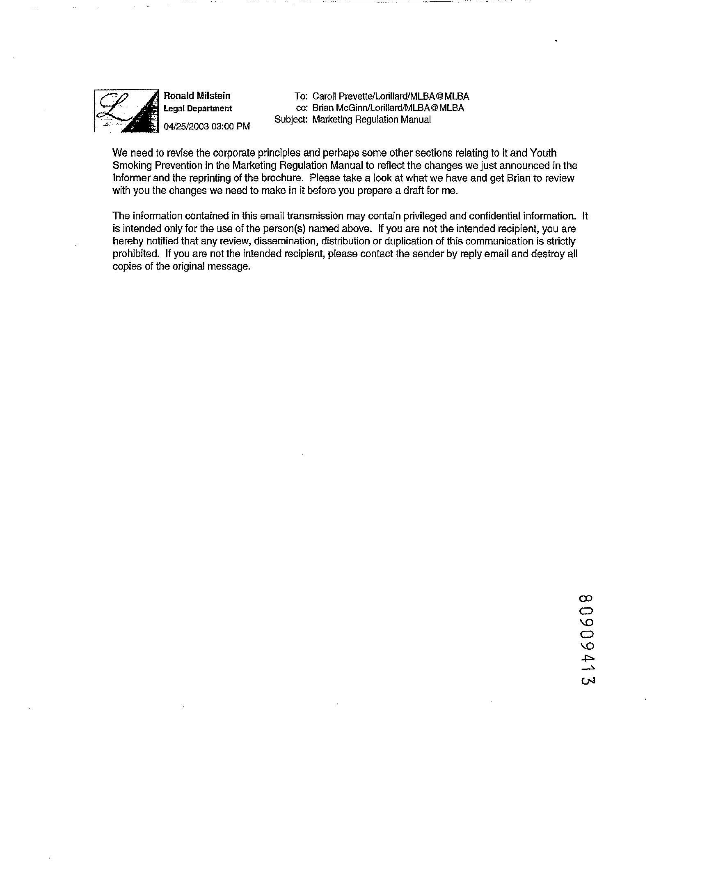

{
  "nbformat": 4,
  "nbformat_minor": 0,
  "metadata": {
    "colab": {
      "provenance": []
    },
    "kernelspec": {
      "name": "python3",
      "display_name": "Python 3"
    },
    "language_info": {
      "name": "python"
    }
  },
  "cells": [
    {
      "cell_type": "markdown",
      "source": [
        "# Historical Document Extraction with AI\n",
        "\n",
        "## Problem\n",
        "**Task:** A collection of emails have been printed and scanned. I believe it will be useful to me to have **create a semi-structured database** of the information contained in the emails.\n",
        "\n",
        "Here is an example of an email and what we wnat to extract from it:\n",
        "\n",
        "\n",
        "\n",
        "\n",
        "Doing this by hand would be tedious! Let's use **AI** creatively instead. I could choose a supervised approach, in which I annotate some number of documents myself and then train models on them. This is still fairly tedious, so I designed an **unsupervised** approach in which I don't need to annotate data."
      ],
      "metadata": {
        "id": "Up-zaqp0H-PO"
      }
    },
    {
      "cell_type": "markdown",
      "source": [
        "## Approach\n",
        "### Overview\n",
        "My approach can be boiled down to 3 steps (and 3 corresponding Colab notebooks):\n",
        "\n",
        "1. **Optical Character Recognition (OCR)**: converting image files into text that can be processed by LLMs.\n",
        "2. **Schema Inference** (SI): prompting an LLM to generate a JSON schema capturing the commonalities among a few sample emails.\n",
        "3. **Information Extraction (IE)**: prompting an LLM with constrained generation to extract information based on the inferred schema.\n",
        "\n",
        "Essentially, images are converted to text, a schema is inferred from the text, and then information is extracted from the text according to the specified schema.\n",
        "\n",
        "\n",
        "\n",
        "### 1. Optical Character Recognition (OCR)\n",
        "The goal of OCR is to convert the text present in an image into textual data. I used **PaddleOCR**, which contains a pipeline of neural networks (CNNs and RNNs) that detect regions of an image containing text and then extract the text within them.\n",
        "\n",
        "### 2. Schema Inference (SI)\n",
        "The goal of SI is to automatically infer schema from the texts—perhaps just from a subset of them. This schema will eventually be used to guide the extraction of information in a semi-structured JSON object. I fed **3 sample emails** to a **LLaMa 3** LLM and instructed it to spot structural elements common to all of them and generate a corresponding JSON schema.\n",
        "\n",
        "### 3. Information Extraction (IE)\n",
        "The goal of IE here is to automatically generate structured records, which follow the schema, from the unstructured text. I prompted a **LlaMa 3** LLM to extract the structured records from the emails, one at a time. I used **Outlines** to perform **constrained generation**, which forces the LLM to generate according to the schema.\n",
        "\n"
      ],
      "metadata": {
        "id": "WPx5Ru9dcNWt"
      }
    },
    {
      "cell_type": "markdown",
      "source": [
        "## How good is this sytem?\n",
        "Here we examine one email as it passes through the pipeline. Here is the raw image:\n",
        "\n",
        "\n",
        "### OCR\n",
        "The OCR was nearly perfect, as we can see in the results below.\n",
        "\n",
        "\n",
        "\n",
        "### Schema Inference\n",
        "The schema that I inferred in an automated fashion (below) is very high quality. This may have been particularly successful because the LLM is surely familiar with the format of emails. A fun experiment would be to try generating a schema without any sample documents.\n",
        "\n",
        "```\n",
        "{\n",
        "  \"$schema\": \"http://json-schema.org/draft-07/schema#\",\n",
        "  \"title\": \"Common Email Structure\",\n",
        "  \"type\": \"object\",\n",
        "  \"properties\": {\n",
        "    \"subject\": {\n",
        "      \"type\": \"string\"\n",
        "    },\n",
        "    \"from\": {\n",
        "      \"type\": \"string\"\n",
        "    },\n",
        "    \"to\": {\n",
        "      \"type\": \"array\",\n",
        "      \"items\": {\n",
        "        \"type\": \"string\"\n",
        "      }\n",
        "    },\n",
        "    \"cc\": {\n",
        "      \"type\": \"array\",\n",
        "      \"items\": {\n",
        "        \"type\": \"string\"\n",
        "      }\n",
        "    },\n",
        "    \"body\": {\n",
        "      \"type\": \"string\"\n",
        "    },\n",
        "    \"date\": {\n",
        "      \"type\": \"string\"\n",
        "    }\n",
        "  },\n",
        "  \"required\": [\n",
        "    \"subject\",\n",
        "    \"from\",\n",
        "    \"to\",\n",
        "    \"cc\",\n",
        "    \"body\",\n",
        "    \"date\"\n",
        "  ]\n",
        "}\n",
        "```\n",
        "\n",
        "### Information Extraction\n",
        "Information extraction was of moderate quality; there were frequent errors. Many of these errors are small and understandable. Many errors could be solved with more advanced constrained generation, in which only the only text that could fill slots in a record is exact quotations from the source text. Here we mark the correct and incorrect information in the extracted record:\n",
        "\n",
        "\n",
        "\n"
      ],
      "metadata": {
        "id": "t9VE5IGMb2Nu"
      }
    },
    {
      "cell_type": "markdown",
      "source": [
        "## Challenges & Solutions\n",
        "\n",
        "- I was **limited by computational resources** because I mainly have access to a personal laptop and I refrained from using state-of-the-art private models available via API as I am given to understand that the security and privacy needs of the company preclude their use. Therefore, I was limited to models with 1 billion parameters, which necessitate more care in prompting, more forethought in generation methods, and more creative methods.\n",
        "- I am familiar with computer vision research, I have limited hands-on experience—I previously specialized in natural language processing, so I had to learn what worked and what didn't. I originally tried to use **Tesseract** for OCR, but the results were poor. I then tried to switch to PaddleOCR, but evidently it is rarely compatible with Apple computers (what I own) despite the existence of installation instructions for them. This is why I resorted to **Colab** notebooks, where I could run Tesseract, instead of my usual VSCode + GitHub stack.\n",
        "- During Schema Inference, prompts I wrote returned generations that were variously **nonsensical**, **unruly**, and **repetitive**. Unlike OCR, natural language processing is my specialty, and I was familiar with these issues as well as tricks of the trade to solve them; this was a lesser challenge. A combination of an **imperious tone** and **extreme seriousness** of certain details in the prompt as well as **deterministic generation** solved the issue.\n",
        "- Vanilla use of generation with LlaMa 3 usually resulted in **invalid JSON** objects. I knew that **constrained generation** was the solution for this, and I found a library (`outlines`) that supports it.\n"
      ],
      "metadata": {
        "id": "O2oAbfBGb79v"
      }
    },
    {
      "cell_type": "markdown",
      "source": [
        "## Notebooks\n",
        "- `OCR.ipynb`: Extracts plain text from scanned documents using PaddleOCR\n",
        "- `schema_inference.ipynb`: Infers JSON schema from OCR text using LLaMA\n",
        "- `information_extraction.ipynb`: Extracts structured records using schema and constrained generation\n"
      ],
      "metadata": {
        "id": "nFU4LB_5cCZs"
      }
    }
  ]
}
